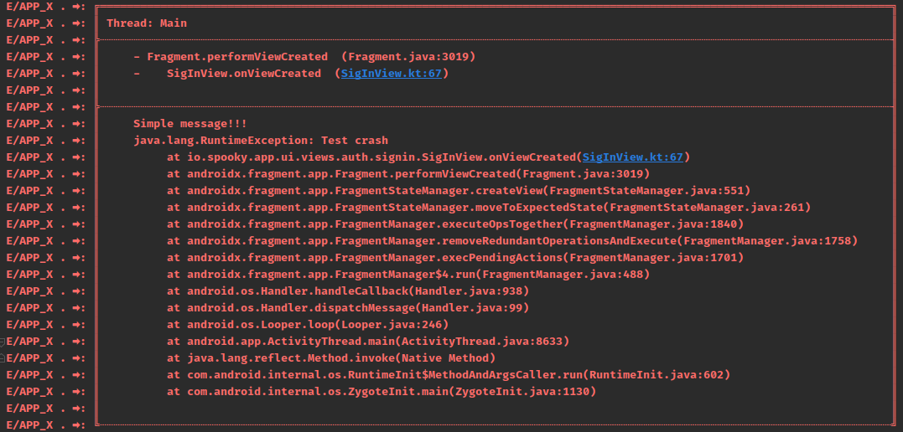

### Preety Timber Logcat

This works in conjunction with Jake Wharton's Timber library and is obviously inspired by the orhanobut/logger library but simpler (just with the closed grid XD).
If you have any suggestions, please let me know.


### Download
```groovy
implementation 'com.github.erick-alvz:pretty-log:1.0.0'
```

```groovy
allprojects {
    repositories {
        maven { url "https://jitpack.io" }
    }
}
```

AndroidStudio 2021.1.1

```groovy
dependencyResolutionManagement {
    repositoriesMode.set(RepositoriesMode.FAIL_ON_PROJECT_REPOS)
    repositories {
        google()
        mavenCentral()
        maven { url 'https://jitpack.io' }
    }
}

```
Initialize
```kotlin
val log = PrettyLog.Builder()
      .tag("APP_X ")  // Optional
      .methodCount(2) // Optional
      .create()
            
Timber.plant(log)
```

Use
```kotlin
logd("Simple message multiline\nThis shit works for now...")
logi("Simple message!!!")
logw("Simple message!!!")
loge("Simple message!!!", th = RuntimeException("Test crash"))
```

### Output


